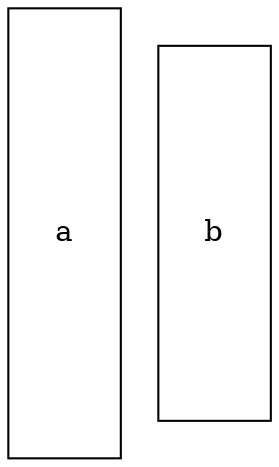

## Size

## **Height**

Sets the height of the node. The height setting takes effect in the following situations:

- When **`fixedsize` is `true`**, the actual height of the node is exactly equal to the set value.
- When **`fixedsize` is `false`**, this height serves as the minimum limit. The actual height will be at least the specified value, but may increase based on content or shape.
- If no height is manually set, the height will be automatically determined based on the node's content and shape during rendering.

**Usage**:

Dot



Java

```java
Node node = Node.builder()
    .height(3.0)
    .build();
```

------

## **Width**

Sets the width of the node. The width setting takes effect in the following situations:

- When **`fixedsize` is `true`**, the actual width of the node will be exactly equal to the set value.
- When **`fixedsize` is `false`**, this width serves as the minimum width. The actual width will be at least the specified value, but may increase based on the content and shape.
- If no width is manually set, the width will be automatically determined based on the node's content and shape during rendering.

**Usage**:

Dot

```dot
digraph G {
    node [shape=ellipse, width=2.5];
    a;
    b [width=2.0];
}.
```

Java

```java
Node node = Node.builder()
    .width(2.5)
    .build();
```

