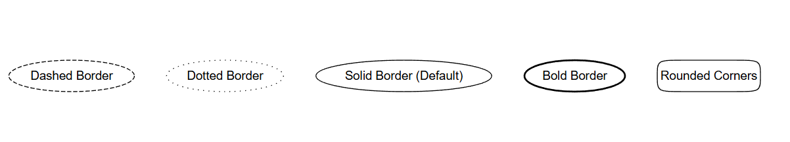

# Node Style

The **style** attribute controls how the **border and shape** of a node are rendered. It can be used to make the node **dashed, dotted, bold, invisible, or rounded**.

## Examples:

Dot


- **`style=dashed`** → Border is a dashed line.
- **`style=dotted`** → Border is a series of dots.
- **`style=solid`** → Default; solid line border.
- **`style=bold`** → Thicker border for emphasis.
- **`style=rounded`** → Smooth, rounded corners (works best with `shape=box`).
- **`style=invis`** → Node is **invisible** (exists in layout but is not displayed).

Java

```java
Node dashedNode = Node.builder()
    .label("Dashed Border")
    .style(NodeStyle.DASHED) // Set node border to dashed
    .build();

Node dottedNode = Node.builder()
    .label("Dotted Border")
    .style(NodeStyle.DOTTED) // Set node border to dotted
    .build();

Node solidNode = Node.builder()
    .label("Solid Border (Default)")
    .style(NodeStyle.SOLID) // Default style
    .build();

Node boldNode = Node.builder()
    .label("Bold Border")
    .style(NodeStyle.BOLD) // Set node border to bold
    .build();

Node roundedNode = Node.builder()
    .label("Rounded Corners")
    .shape(NodeShapeEnum.BOX) // Works best with box shape
    .style(NodeStyle.ROUNDED) // Apply rounded corners
    .build();

Node invisibleNode = Node.builder()
    .label("Invisible Node")
    .style(NodeStyle.INVIS) // Hidden node
    .build();
```

- **`style(NodeStyle.DASHED)`** → Dashed border.
- **`style(NodeStyle.DOTTED)`** → Dotted border.
- **`style(NodeStyle.BOLD)`** → Thicker border.
- **`style(NodeStyle.ROUNDED)`** → Rounded corners.
- **`style(NodeStyle.INVIS)`** → Node is invisible but still part of the layout.

