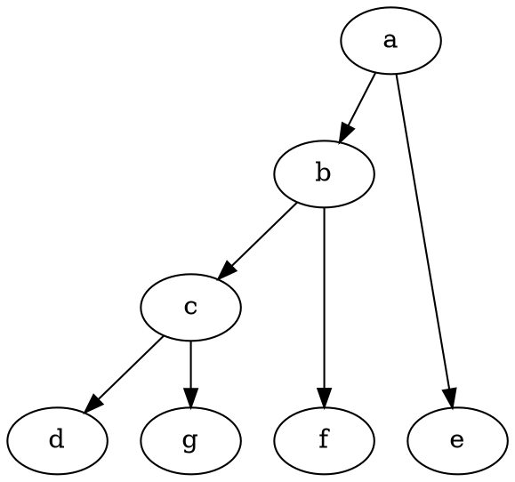
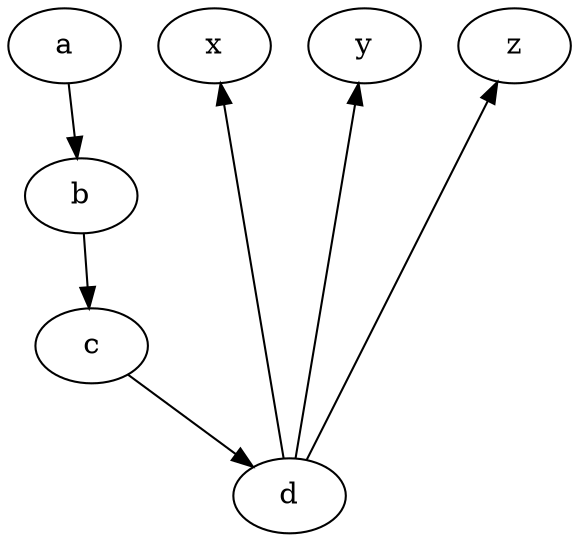
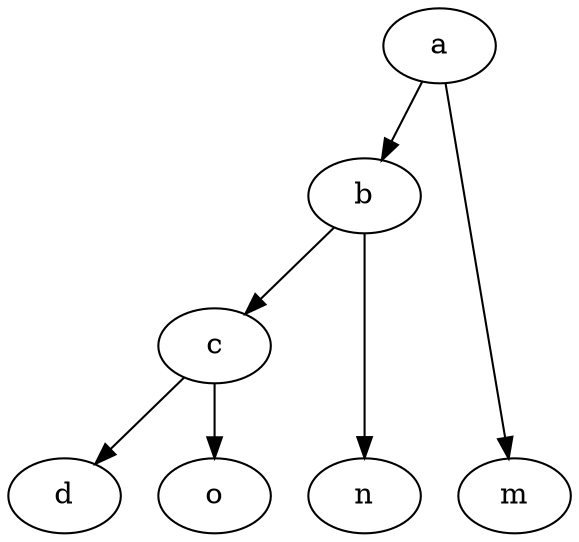

# Rank

The **rank** attribute controls the **relative positioning of nodes within a subgraph**. It ensures that **all nodes within the group** are placed at the **same level** in hierarchical layouts.

------

## **Behavior**

- **Applies only to `subgraph` elements or anonymous `{}` groups** in hierarchical layouts (`dot`).
- **Forces all nodes in the group to be placed at the same rank (level).**
- **Only works in `dot` layout**, **not in `fdp`, `sfdp`, `neato`, etc.**
- Common values:
  - `"same"` → Nodes are placed at the **same level**.
  - `"min"` → Nodes are placed at the **lowest possible level**.
  - `"max"` → Nodes are placed at the **highest possible level**.
  - `"source"` → Nodes are placed at the **top** (source of the graph).
  - `"sink"` → Nodes are placed at the **bottom** (sink of the graph).

------

## **Usage in DOT**

### **Using an Anonymous Group (`{}`) to Force Same Rank**



### **Using a Subgraph to Force Same Rank**


### **Forcing Nodes to the Minimum Rank**



### **Forcing Nodes to the Maximum Rank (Bottom of the Graph)**



------

## **Usage in Java**

### **Force Nodes to Be on the Same Rank**

```java
Node e = Node.builder().label("e").build();
Node f = Node.builder().label("f").build();
Node g = Node.builder().label("g").build();

Subgraph subgraph = Subgraph.builder()
    .rank(Rank.SAME)  // Aligns all nodes in the subgraph at the same level
    .addNode(e, f, g)
    .build();

Graphviz graph = Graphviz.digraph()
    .subgraph(subgraph)
    .build();
```

